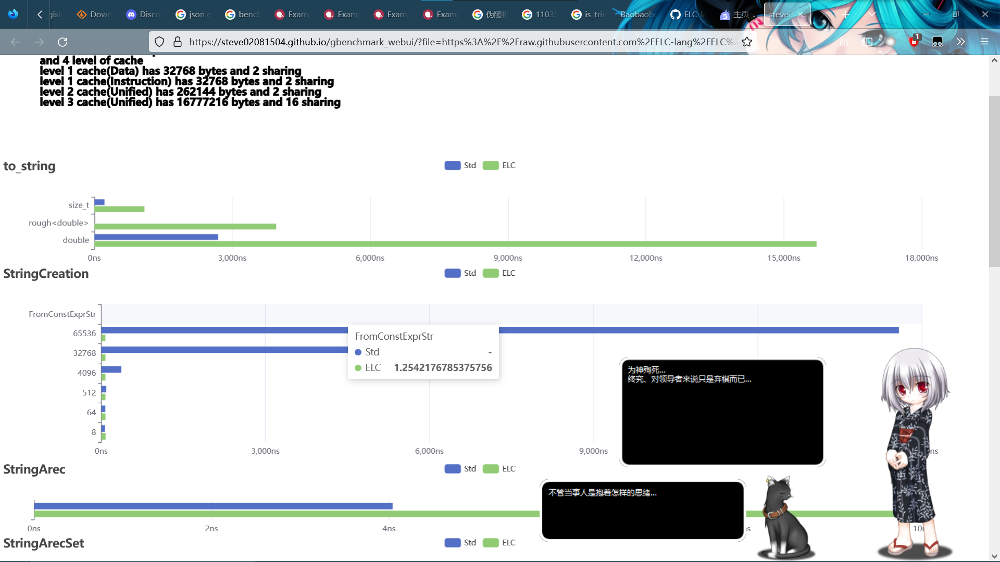

# gbenchmark_webui

今天算是第一次接触js并用来写ui，所以写的比较low，还有很多todo没搞。  
凑合用吧。  
用于可视化展示 Google Benchmark 的结果。  
全本地运行静态页面，不需要服务器。  

## 例图

  
[点击查看](https://steve02081504.github.io/gbenchmark_webui/?file=https%3A%2F%2Fraw.githubusercontent.com%2FELC-lang%2FELC%2Fmaster%2Fparts%2Fheader_file%2Ftest%2Felc_string_VS_std_string_BENCHMARK%2Fresult.json)

## 参数

- `file`：Google Benchmark 输出的 JSON 文件的url  

不带参数也行，拖拽文件就可。

## TODO

- [ ] 优化样式
- [ ] `bytes_per_second`支持  
- [ ] `allocs_per_iter`支持  
- [ ] 其他  
